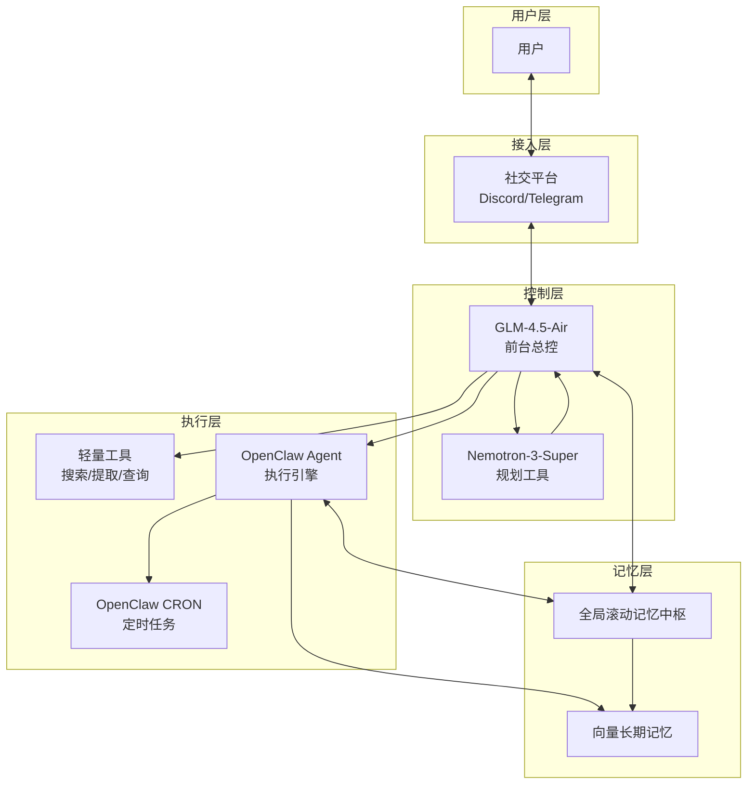
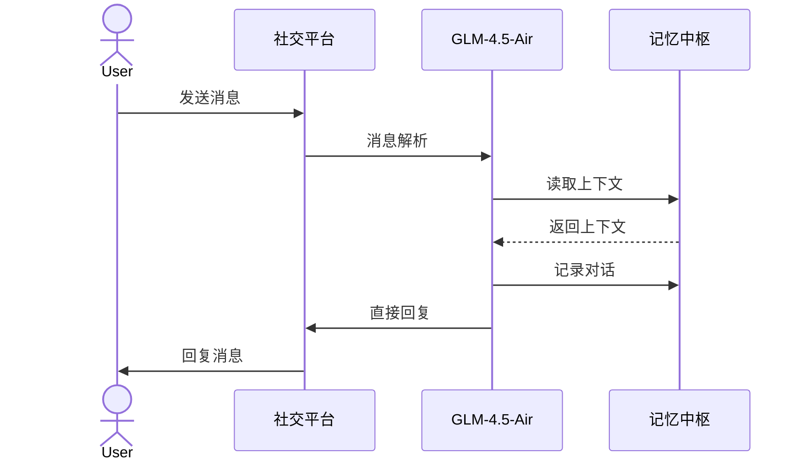
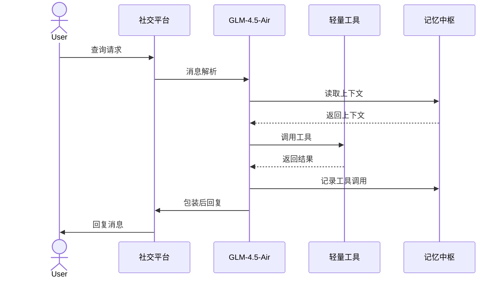
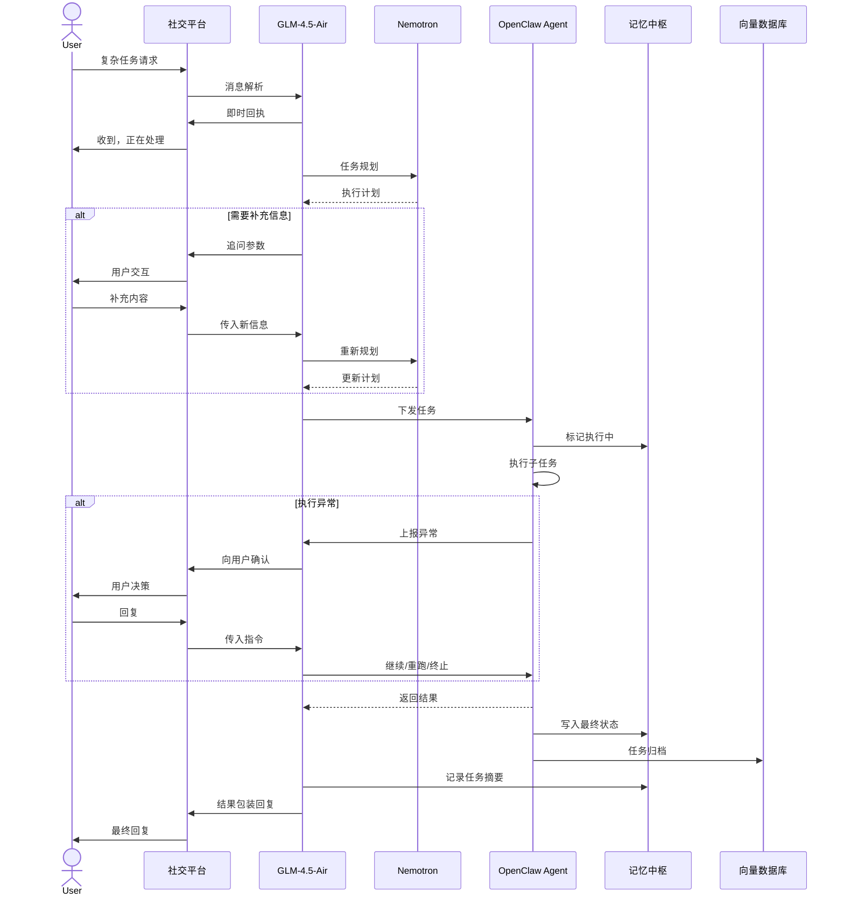
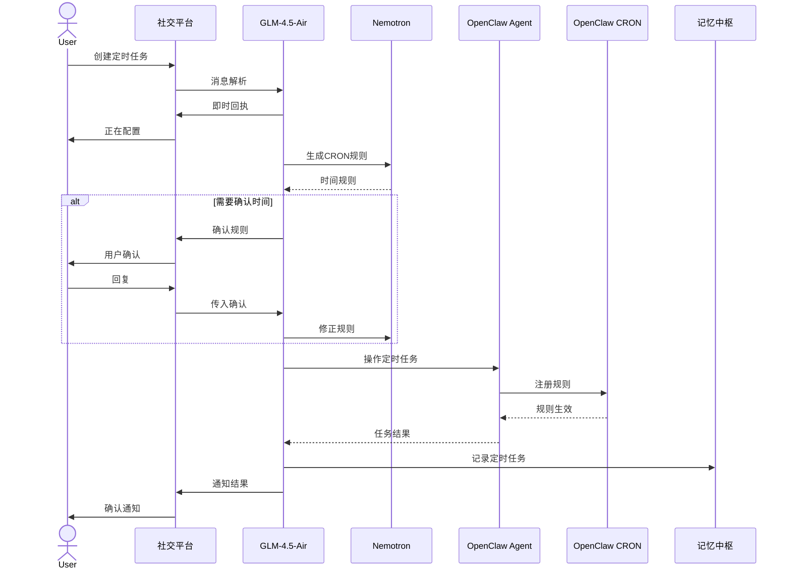
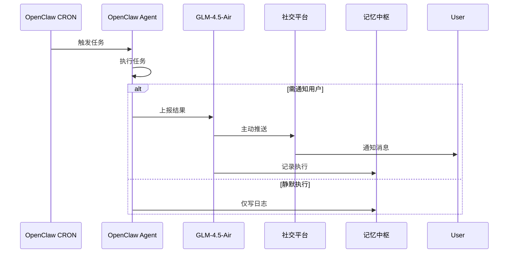
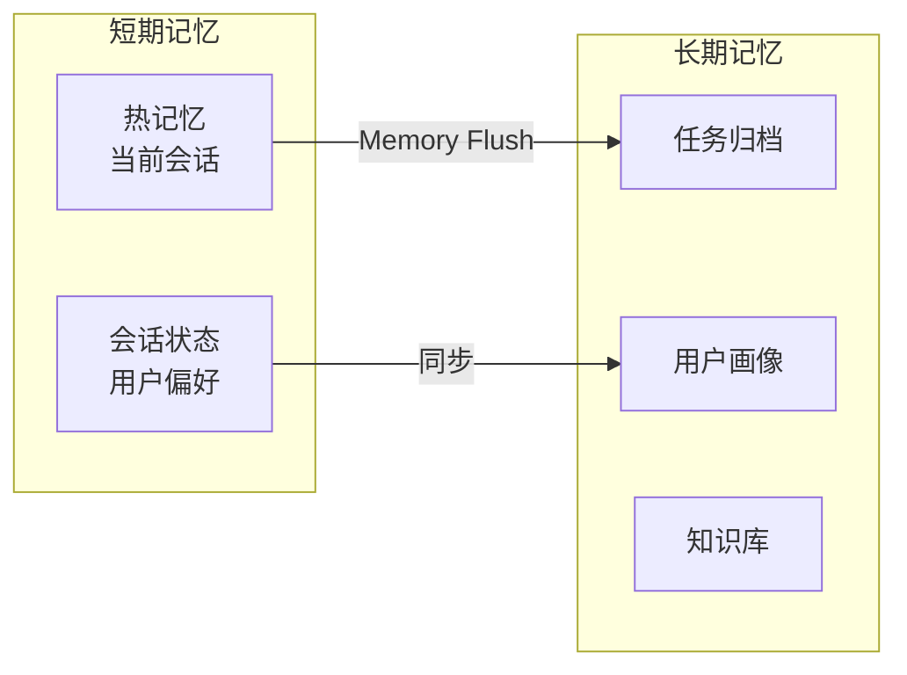
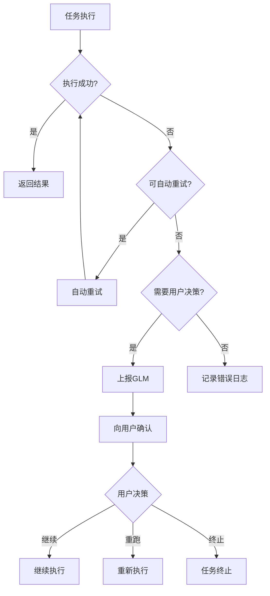
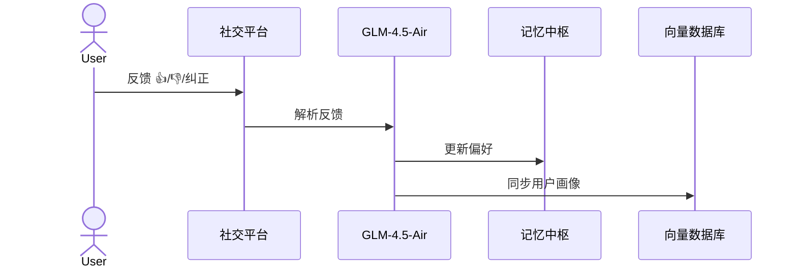
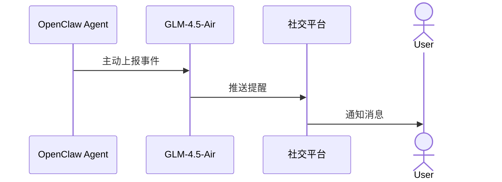

# 小悠 (Xiaoyou) - 多智能体协作系统

## 项目概述

小悠是一个基于多模型协作的智能助手系统，通过 Discord/Telegram 等社交平台为用户提供陪伴聊天、信息查询、复杂任务执行和定时任务管理等服务。系统采用分层架构设计，以可配置聊天模型为前台总控，结合 Nemotron-3-Super 规划引擎和 OpenClaw 执行引擎，实现从简单对话到复杂自动化的全场景覆盖。当前支持通过 `MODEL_ID`、`EMBEDDING_MODEL_ID`、`VISION_MODEL_ID` 分别配置聊天、向量和多模态模型 ID。

## 系统架构



## 核心组件

### 1. 聊天模型 / GLM 服务（前台总控）

作为系统的唯一入口和中央控制器，负责：

- **消息解析**：接收来自社交平台的多模态输入（文本/图片/文件/指令），并通过视觉大语言模型完成统一理解与摘要
- **意图识别**：分析用户请求，进行场景分流
- **上下文管理**：与记忆系统交互，维护会话状态
- **响应生成**：直接回复或包装工具/执行结果

> 默认可使用 GLM 系列模型，也可以通过环境变量切换为其他兼容模型。其中图片、文档、视频等多模态理解能力由 `VISION_MODEL_ID` 单独控制，向量嵌入由 `EMBEDDING_MODEL_ID` 单独控制。

### 2. Nemotron-3-Super（规划工具）

专门用于复杂任务的规划引擎，负责：

- **任务分解**：将复杂任务拆解为结构化执行计划
- **参数验证**：识别缺失参数，生成追问逻辑
- **CRON 规则生成**：为定时任务生成时间规则

### 3. OpenClaw Agent（执行引擎）

基于 [OpenClaw](https://docs.openclaw.ai/zh-CN) 的任务执行引擎，负责：

- **任务执行**：按计划执行子任务，支持多智能体协作
- **状态管理**：跟踪执行进度和状态
- **重试机制**：处理执行失败和重试逻辑
- **异常上报**：将需要用户决策的异常上报给 GLM
- **CRON 调度**：通过 OpenClaw CRON 实现定时任务管理

### 4. OpenClaw CRON（定时任务管理）

基于 OpenClaw 的定时任务调度中心，负责：

- **规则注册**：注册/更新/删除定时规则
- **定时触发**：按计划自动触发任务执行
- **执行通知**：根据配置通知用户或静默执行

### 5. 全局滚动记忆中枢（Memory）

短期记忆和会话状态管理，负责：

- **热记忆存储**：维护当前会话的上下文信息
- **用户偏好**：记录和更新用户偏好设置
- **任务状态**：跟踪任务执行状态
- **记忆刷新**：定期将记忆归档到向量数据库

### 6. 向量长期记忆（VectorDB）

长期记忆存储，负责：

- **任务归档**：存储历史任务记录
- **用户画像**：维护长期用户画像
- **语义检索**：支持基于向量的相似性搜索

### 7. 轻量工具（Tools）

单次调用的轻量级工具集，包括：

- **搜索工具**：网络搜索和信息检索
- **提取工具**：从内容中提取结构化信息
- **查询工具**：数据库或 API 查询

## 业务流程

### 场景 A：陪伴聊天 / 普通问答

适用于日常对话、情感陪伴和简单问答场景。



**特点**：
- 无需外部工具调用
- 响应速度快
- 上下文连续性强

### 场景 B：简单查询 / 轻工具

适用于需要单次工具调用的查询场景。



**特点**：
- 单次工具调用
- 结果经过 GLM 包装
- 保持对话风格一致

### 场景 C：复杂任务 / 代码 / 自动化

适用于需要多步骤执行的复杂任务场景。



**特点**：
- 多步骤规划执行
- 支持参数补充
- 异常处理和用户确认
- 任务归档存储

### 场景 D：定时任务管理

适用于需要定时执行的任务场景。



**定时触发流程**：



**特点**：
- 支持 CRON 规则配置
- 时间规则确认机制
- 支持通知/静默两种模式
- 支持任务的增删改查

## 记忆系统

### 记忆层次结构



### 记忆流转机制

1. **读取阶段**：GLM 在处理请求前先从 Memory 读取热记忆和会话状态
2. **更新阶段**：对话、工具调用、任务执行等信息实时写入 Memory
3. **归档阶段**：通过 Memory Flush 将短期记忆同步到 VectorDB 长期存储
4. **反馈学习**：用户反馈（👍👎/纠正）更新用户画像和偏好

## 异常处理与降级机制

### 异常处理流程



### 降级机制

当规划模型（Nemotron-3-Super）超时或不可用时：

1. GLM 检测到 Nvidia 服务异常
2. 向社交平台发送繁忙提示
3. 用户收到"稍后处理"的降级提示
4. 系统记录异常日志，等待服务恢复

## 用户反馈机制



**支持的反馈类型**：
- 👍 正面反馈：强化当前行为模式
- 👎 负面反馈：调整响应策略
- 文字纠正：更新用户偏好和画像

## 主动推送机制

OpenClaw Agent 支持主动向用户推送消息：



**推送场景**：
- 任务完成通知
- 异常预警
- 定时任务执行结果

## 技术栈

| 组件 | 技术选型 |
|------|----------|
| 快速响应 | Quick 模型（聊天、意图识别、视觉分析） |
| 任务规划 | Plan 模型（任务分解、CRON 生成） |
| 执行引擎 | [OpenClaw Agent](https://docs.openclaw.ai/zh-CN) |
| 定时调度 | OpenClaw CRON |
| 短期记忆 | 内存热记忆（可扩展 Redis） |
| 长期记忆 | Qdrant（向量数据库） |
| 社交平台 | Discord / Telegram |

## 当前实现进展

当前代码已完成文档中核心分层能力的首版落地：

- **网关层**：[`src/gateway/index.ts`](src/gateway/index.ts) 已串联消息解析、多模态提取与限流检查，当前多模态链路以视觉大语言模型接口为核心，并支持将附件摘要注入消息元数据。
- **控制层**：[`src/controller/intent.ts`](src/controller/intent.ts)、[`src/controller/router.ts`](src/controller/router.ts)、[`src/controller/context.ts`](src/controller/context.ts) 已拆分实现，分别负责意图识别、优先级路由与会话上下文管理。
- **服务层**：[`src/services/index.ts`](src/services/index.ts) 已提供聊天、工具、复杂任务、定时任务四类场景服务。
- **执行层**：[`src/llm/plan.ts`](src/llm/plan.ts)、[`src/executor/openclaw-agent.ts`](src/executor/openclaw-agent.ts)、[`src/executor/openclaw-cron.ts`](src/executor/openclaw-cron.ts) 已支持计划生成、参数校验、执行状态控制与定时调度。
- **记忆层**：[`src/memory/hot.ts`](src/memory/hot.ts)、[`src/memory/vector.ts`](src/memory/vector.ts)、[`src/memory/flush.ts`](src/memory/flush.ts) 已支持热记忆、向量检索、任务归档与偏好刷新。
- **工具层**：[`src/tools/index.ts`](src/tools/index.ts) 已重构为可注册、可发现、可鉴权的 Tool Registry。
- **测试**：已补充 [`tests/unit/router.test.ts`](tests/unit/router.test.ts)、[`tests/unit/context.test.ts`](tests/unit/context.test.ts)、[`tests/unit/multimodal.test.ts`](tests/unit/multimodal.test.ts) 等单元测试。

## 文档索引

| 文档 | 说明 |
|------|------|
| [详细设计文档](docs/design.md) | 系统分层设计、核心组件详细设计、数据流、接口定义、安全与性能设计 |
| [实现指南](docs/implementation.md) | 技术栈选型、项目结构、核心模块实现代码、测试策略、部署指南 |
| [API 接口文档](docs/api.md) | 所有内部/外部 API 接口定义、WebSocket 事件、错误码 |
| [配置说明](docs/configuration.md) | 环境变量、运行时配置、Prompt 模板、Docker 配置、数据库 Schema |

## 快速开始

```bash
# 1. 克隆项目
git clone https://github.com/your-org/xiaoyou.git
cd xiaoyou

# 2. 安装依赖
npm install

# 3. 配置环境变量
cp .env.example .env
# 编辑 .env 填入各服务的 API Key

# 4. 初始化数据库
npx prisma migrate dev

# 5. 启动开发服务
npm run dev
```

详细配置请参考 [配置说明](docs/configuration.md)。

## 贡献指南

（待补充：开发和贡献说明）

## 许可证

（待补充：许可证信息）
