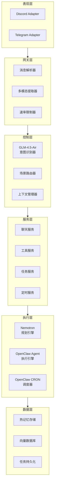
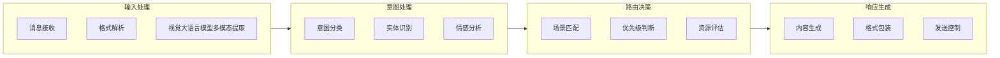
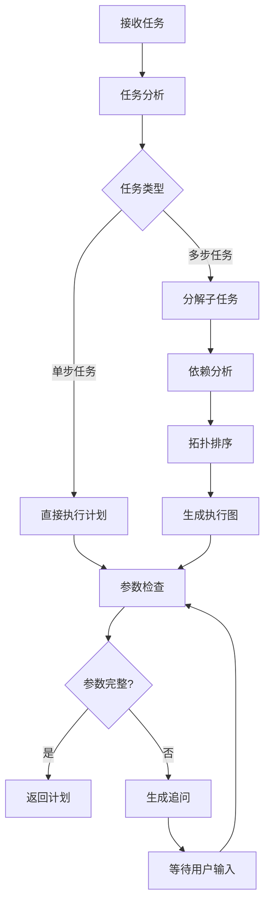
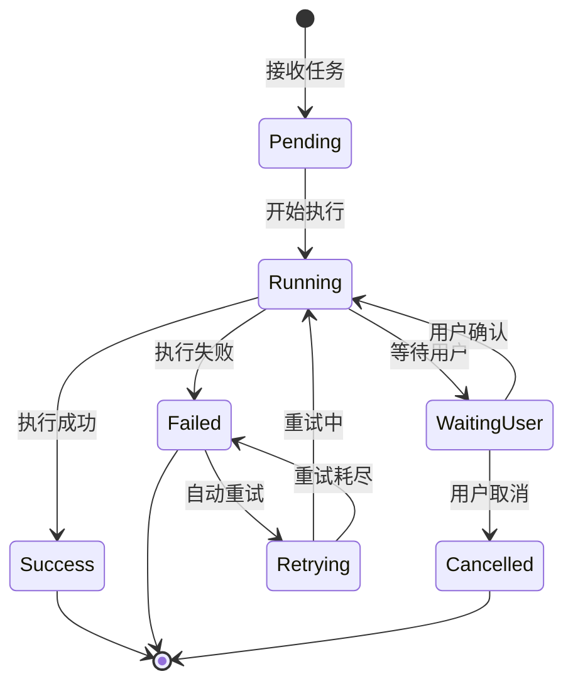
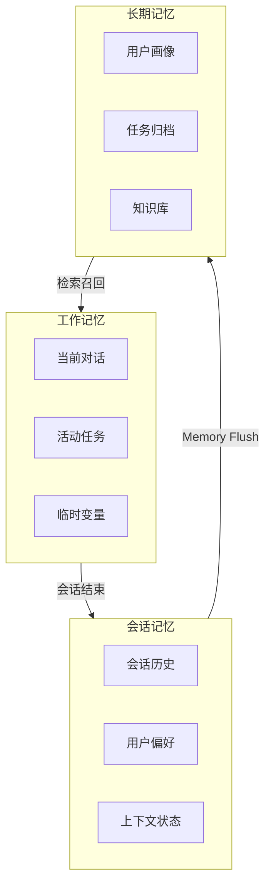
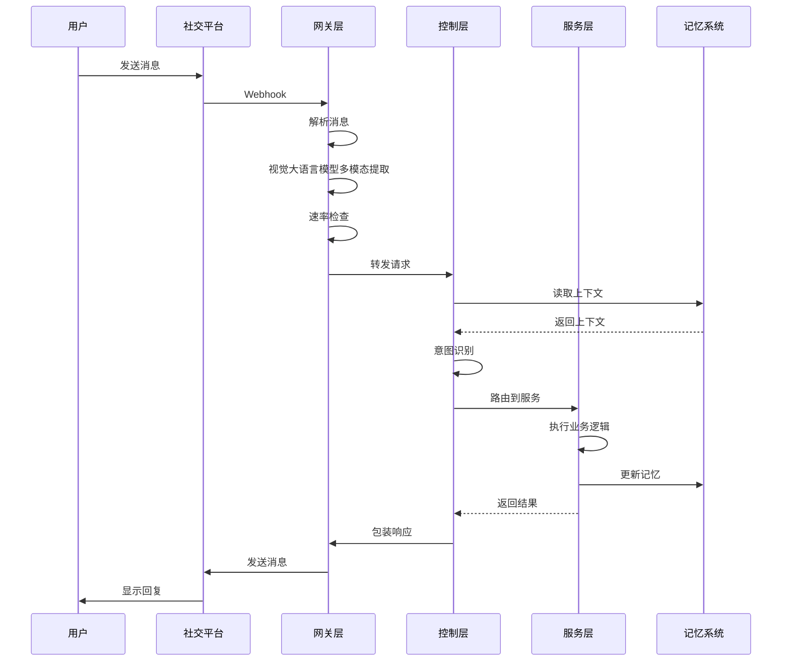
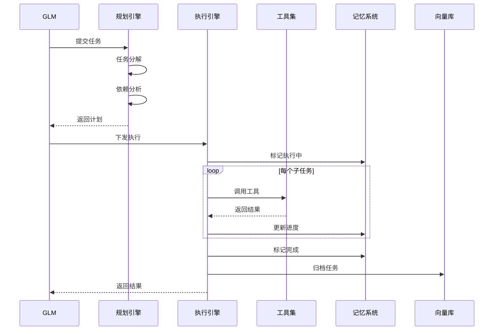

# 小悠系统详细设计文档

## 1. 设计目标

### 1.1 核心目标

- **多模态交互**：支持文本、图片、文件等多种输入形式，并以视觉大语言模型作为统一理解入口
- **智能路由**：根据意图自动选择最优处理路径
- **任务编排**：支持简单到复杂的各类任务执行
- **记忆持久化**：短期热记忆 + 长期向量记忆的双层架构
- **高可用性**：降级机制保证服务稳定性

### 1.2 设计原则

| 原则 | 描述 |
|------|------|
| 单一入口 | GLM 作为唯一用户交互入口，统一管理所有请求 |
| 职责分离 | 规划、执行、记忆各司其职，降低耦合 |
| 异步优先 | 耗时操作异步执行，保证响应速度 |
| 渐进增强 | 基础功能稳定可用，高级功能按需加载 |
| 用户主导 | 关键决策需用户确认，保证可控性 |

## 2. 系统分层设计

### 2.1 分层架构图



### 2.2 各层职责

#### 表现层

负责与外部平台的对接，处理平台特定的协议转换。Discord 和 Telegram 接入由系统自行实现。

```typescript
interface PlatformAdapter {
  // 接收消息
  onMessage(callback: MessageHandler): void;
  // 发送消息
  sendMessage(channelId: string, content: MessageContent): Promise<void>;
  // 发送即时回执
  sendTyping(channelId: string): Promise<void>;
  // 上传文件
  uploadFile(channelId: string, file: Buffer): Promise<string>;
}
```

#### 网关层

负责消息的预处理和安全检查。

```typescript
interface GatewayService {
  // 解析消息
  parseMessage(raw: RawMessage): ParsedMessage;
  // 通过视觉大语言模型提取并汇总多模态内容
  extractMultimodal(message: ParsedMessage): MultimodalContent;
  // 速率限制检查
  checkRateLimit(userId: string): boolean;
}
```

#### 控制层

负责意图识别和请求路由。

```typescript
interface ControllerService {
  // 识别意图
  recognizeIntent(message: ParsedMessage): Intent;
  // 路由到对应场景
  routeToScene(intent: Intent): SceneHandler;
  // 管理上下文
  manageContext(sessionId: string): SessionContext;
}
```

#### 服务层

负责业务逻辑的实现。

```typescript
interface ServiceLayer {
  // 聊天服务
  chatService: ChatService;
  // 工具服务
  toolService: ToolService;
  // 任务服务
  taskService: TaskService;
  // 定时服务
  scheduleService: ScheduleService;
}
```

#### 执行层

负责具体任务的执行和调度。

```typescript
interface ExecutionLayer {
  // 规划引擎
  planner: PlannerEngine;
  // 执行引擎
  executor: ExecutorEngine;
  // 调度引擎
  scheduler: SchedulerEngine;
}
```

#### 数据层

负责数据的持久化和检索。

```typescript
interface DataLayer {
  // 热记忆
  hotMemory: HotMemoryStore;
  // 向量存储
  vectorDB: VectorDatabase;
  // 任务存储
  taskStore: TaskPersistence;
}
```

## 3. 核心组件详细设计

### 3.1 GLM-4.5-Air 前台总控

#### 3.1.1 职责定义



#### 3.1.2 意图分类体系

```typescript
enum IntentType {
  // 聊天类
  CHAT_CASUAL = 'chat.casual',           // 闲聊
  CHAT_EMOTIONAL = 'chat.emotional',     // 情感陪伴
  CHAT_QUESTION = 'chat.question',       // 简单问答

  // 工具类
  TOOL_SEARCH = 'tool.search',           // 搜索
  TOOL_EXTRACT = 'tool.extract',         // 提取
  TOOL_QUERY = 'tool.query',             // 查询

  // 任务类
  TASK_CODE = 'task.code',               // 代码生成
  TASK_AUTOMATION = 'task.automation',   // 自动化
  TASK_ANALYSIS = 'task.analysis',       // 分析任务

  // 定时类
  SCHEDULE_CREATE = 'schedule.create',   // 创建定时
  SCHEDULE_MODIFY = 'schedule.modify',   // 修改定时
  SCHEDULE_CANCEL = 'schedule.cancel',   // 取消定时
  SCHEDULE_QUERY = 'schedule.query',     // 查询定时

  // 反馈类
  FEEDBACK_POSITIVE = 'feedback.positive',
  FEEDBACK_NEGATIVE = 'feedback.negative',
  FEEDBACK_CORRECTION = 'feedback.correction',
}
```

#### 3.1.3 场景路由规则

```typescript
interface RoutingRule {
  intent: IntentType | IntentType[];
  scene: SceneType;
  priority: number;
  condition?: RoutingCondition;
}

const routingRules: RoutingRule[] = [
  // 聊天场景
  {
    intent: [IntentType.CHAT_CASUAL, IntentType.CHAT_EMOTIONAL, IntentType.CHAT_QUESTION],
    scene: SceneType.CHAT,
    priority: 1,
  },
  // 工具场景
  {
    intent: [IntentType.TOOL_SEARCH, IntentType.TOOL_EXTRACT, IntentType.TOOL_QUERY],
    scene: SceneType.TOOL,
    priority: 2,
  },
  // 任务场景
  {
    intent: [IntentType.TASK_CODE, IntentType.TASK_AUTOMATION, IntentType.TASK_ANALYSIS],
    scene: SceneType.TASK,
    priority: 3,
    condition: { requiresPlanning: true },
  },
  // 定时场景
  {
    intent: [IntentType.SCHEDULE_CREATE, IntentType.SCHEDULE_MODIFY, IntentType.SCHEDULE_CANCEL],
    scene: SceneType.SCHEDULE,
    priority: 4,
  },
];
```

### 3.2 Nemotron-3-Super 规划引擎

#### 3.2.1 规划流程



#### 3.2.2 执行计划结构

```typescript
interface ExecutionPlan {
  // 计划ID
  planId: string;
  // 任务描述
  description: string;
  // 子任务列表
  steps: ExecutionStep[];
  // 依赖关系
  dependencies: DependencyGraph;
  // 预估时间
  estimatedDuration: number;
  // 所需资源
  requiredResources: Resource[];
  // 回滚策略
  rollbackStrategy: RollbackStrategy;
}

interface ExecutionStep {
  stepId: string;
  action: string;
  params: Record<string, any>;
  requiredParams: string[];
  optionalParams: string[];
  timeout: number;
  retryPolicy: RetryPolicy;
  onFailure: FailureAction;
}

interface DependencyGraph {
  // DAG 结构
  nodes: string[];
  edges: Array<{ from: string; to: string }>;
}
```

#### 3.2.3 CRON 规则生成

```typescript
interface CronRule {
  // CRON 表达式
  expression: string;
  // 人类可读描述
  description: string;
  // 时区
  timezone: string;
  // 开始时间
  startTime?: Date;
  // 结束时间
  endTime?: Date;
  // 重复次数限制
  maxExecutions?: number;
}

// 自然语言转 CRON
function parseNaturalLanguageToCron(input: string): CronRule {
  // 示例输入：
  // "每天早上9点" -> "0 9 * * *"
  // "每周一至周五下午3点" -> "0 15 * * 1-5"
  // "每小时执行一次" -> "0 * * * *"
}
```

### 3.3 OpenClaw Agent 执行引擎

#### 3.3.1 执行状态机



#### 3.3.2 执行器接口

```typescript
interface Executor {
  // 执行单步任务
  execute(step: ExecutionStep): Promise<StepResult>;
  // 执行完整计划
  executePlan(plan: ExecutionPlan): Promise<PlanResult>;
  // 暂停执行
  pause(planId: string): Promise<void>;
  // 恢复执行
  resume(planId: string): Promise<void>;
  // 取消执行
  cancel(planId: string): Promise<void>;
  // 获取状态
  getStatus(planId: string): Promise<ExecutionStatus>;
}

interface StepResult {
  stepId: string;
  status: 'success' | 'failed' | 'skipped';
  output?: any;
  error?: Error;
  duration: number;
}

interface PlanResult {
  planId: string;
  status: 'success' | 'partial' | 'failed' | 'cancelled';
  stepResults: StepResult[];
  totalDuration: number;
  artifacts?: Artifact[];
}
```

#### 3.3.3 重试策略

```typescript
interface RetryPolicy {
  // 最大重试次数
  maxRetries: number;
  // 重试间隔（毫秒）
  retryInterval: number;
  // 间隔倍增因子
  backoffMultiplier: number;
  // 最大间隔
  maxInterval: number;
  // 可重试的错误类型
  retryableErrors: string[];
}

const defaultRetryPolicy: RetryPolicy = {
  maxRetries: 3,
  retryInterval: 1000,
  backoffMultiplier: 2,
  maxInterval: 30000,
  retryableErrors: ['TIMEOUT', 'RATE_LIMIT', 'TEMPORARY_FAILURE'],
};
```

### 3.4 记忆系统设计

#### 3.4.1 记忆架构



#### 3.4.2 热记忆结构

```typescript
interface HotMemory {
  // 会话ID
  sessionId: string;
  // 用户ID
  userId: string;
  // 对话历史
  conversationHistory: ConversationTurn[];
  // 活动任务
  activeTasks: ActiveTask[];
  // 用户偏好
  userPreferences: UserPreferences;
  // 上下文变量
  contextVariables: Record<string, any>;
  // 最后更新时间
  lastUpdated: Date;
  // TTL
  ttl: number;
}

interface ConversationTurn {
  turnId: string;
  timestamp: Date;
  role: 'user' | 'assistant' | 'system';
  content: string;
  intent?: IntentType;
  entities?: Entity[];
  sentiment?: Sentiment;
}

interface UserPreferences {
  // 语言偏好
  language: string;
  // 回复风格
  responseStyle: 'concise' | 'detailed' | 'casual' | 'formal';
  // 通知设置
  notificationSettings: NotificationSettings;
  // 时区
  timezone: string;
  // 自定义配置
  customSettings: Record<string, any>;
}
```

#### 3.4.3 向量记忆结构

```typescript
interface VectorMemory {
  // 向量ID
  id: string;
  // 原始内容
  content: string;
  // 向量嵌入
  embedding: number[];
  // 元数据
  metadata: VectorMetadata;
  // 创建时间
  createdAt: Date;
  // 过期时间
  expiresAt?: Date;
}

interface VectorMetadata {
  // 记忆类型
  type: 'conversation' | 'task' | 'preference' | 'knowledge';
  // 用户ID
  userId: string;
  // 会话ID
  sessionId?: string;
  // 任务ID
  taskId?: string;
  // 重要性分数
  importance: number;
  // 访问次数
  accessCount: number;
  // 标签
  tags: string[];
}
```

#### 3.4.4 记忆检索策略

```typescript
interface RetrievalStrategy {
  // 检索方法
  method: 'similarity' | 'keyword' | 'hybrid';
  // 返回数量
  topK: number;
  // 相似度阈值
  threshold: number;
  // 时间范围
  timeRange?: TimeRange;
  // 过滤条件
  filters?: Record<string, any>;
}

// 混合检索实现
async function hybridRetrieval(
  query: string,
  strategy: RetrievalStrategy
): Promise<VectorMemory[]> {
  // 1. 向量相似度检索
  const vectorResults = await vectorSearch(query, strategy.topK);
  
  // 2. 关键词检索
  const keywordResults = await keywordSearch(query, strategy.topK);
  
  // 3. 结果融合（RRF）
  const mergedResults = reciprocalRankFusion([
    vectorResults,
    keywordResults,
  ]);
  
  // 4. 过滤和排序
  return mergedResults
    .filter(r => r.score >= strategy.threshold)
    .slice(0, strategy.topK);
}
```

## 4. 数据流设计

### 4.1 消息处理流水线



### 4.2 任务执行数据流



## 5. 接口设计

### 5.1 内部服务接口

#### 5.1.1 GLM 接口

```typescript
interface GLMService {
  // 处理消息
  handleMessage(message: IncomingMessage): Promise<OutgoingMessage>;
  // 生成回复
  generateReply(context: ConversationContext): Promise<string>;
  // 意图识别
  recognizeIntent(message: string): Promise<IntentResult>;
  // 实体提取
  extractEntities(message: string): Promise<Entity[]>;
}
```

#### 5.1.2 规划接口

```typescript
interface PlannerService {
  // 创建执行计划
  createPlan(task: TaskDescription): Promise<ExecutionPlan>;
  // 更新计划
  updatePlan(planId: string, updates: Partial<ExecutionPlan>): Promise<ExecutionPlan>;
  // 验证参数
  validateParams(plan: ExecutionPlan): ValidationResult;
  // 生成追问
  generateClarification(missingParams: string[]): Promise<ClarificationQuestion>;
}
```

#### 5.1.3 执行接口

```typescript
interface ExecutorService {
  // 执行计划
  executePlan(plan: ExecutionPlan): Promise<ExecutionResult>;
  // 获取状态
  getStatus(executionId: string): Promise<ExecutionStatus>;
  // 控制执行
  control(executionId: string, action: ControlAction): Promise<void>;
}

type ControlAction = 'pause' | 'resume' | 'cancel' | 'retry';
```

#### 5.1.4 记忆接口

```typescript
interface MemoryService {
  // 读取热记忆
  getHotMemory(sessionId: string): Promise<HotMemory>;
  // 更新热记忆
  updateHotMemory(sessionId: string, updates: Partial<HotMemory>): Promise<void>;
  // 检索长期记忆
  retrieveLongTerm(query: string, options: RetrievalOptions): Promise<VectorMemory[]>;
  // 归档到长期记忆
  archive(sessionId: string): Promise<void>;
}
```

### 5.2 外部平台接口

#### 5.2.1 Discord 适配器

```typescript
interface DiscordAdapter extends PlatformAdapter {
  // 处理 Slash 命令
  handleSlashCommand(interaction: DiscordInteraction): Promise<void>;
  // 处理按钮交互
  handleButtonInteraction(interaction: DiscordInteraction): Promise<void>;
  // 发送 Embed 消息
  sendEmbed(channelId: string, embed: DiscordEmbed): Promise<void>;
}
```

#### 5.2.2 Telegram 适配器

```typescript
interface TelegramAdapter extends PlatformAdapter {
  // 处理回调查询
  handleCallbackQuery(query: TelegramCallbackQuery): Promise<void>;
  // 发送 Inline Keyboard
  sendInlineKeyboard(chatId: string, keyboard: InlineKeyboard): Promise<void>;
  // 发送 Markdown 消息
  sendMarkdown(chatId: string, text: string): Promise<void>;
}
```

## 6. 错误处理设计

### 6.1 错误分类

```typescript
enum ErrorCategory {
  // 用户错误
  USER_INPUT = 'user_input',
  USER_CANCEL = 'user_cancel',
  
  // 系统错误
  INTERNAL = 'internal',
  TIMEOUT = 'timeout',
  RATE_LIMIT = 'rate_limit',
  
  // 外部服务错误
  LLM_ERROR = 'llm_error',
  TOOL_ERROR = 'tool_error',
  PLATFORM_ERROR = 'platform_error',
  
  // 资源错误
  RESOURCE_EXHAUSTED = 'resource_exhausted',
  STORAGE_ERROR = 'storage_error',
}
```

### 6.2 错误处理策略

```typescript
interface ErrorHandler {
  // 错误分类
  categorize(error: Error): ErrorCategory;
  // 判断是否可重试
  isRetryable(error: Error): boolean;
  // 获取用户友好消息
  getUserMessage(error: Error): string;
  // 获取恢复建议
  getRecoverySuggestion(error: Error): string;
}

const errorHandlingStrategy: Record<ErrorCategory, HandlingStrategy> = {
  [ErrorCategory.USER_INPUT]: {
    retryable: false,
    notifyUser: true,
    logLevel: 'info',
  },
  [ErrorCategory.USER_CANCEL]: {
    retryable: false,
    notifyUser: false,
    logLevel: 'info',
  },
  [ErrorCategory.INTERNAL]: {
    retryable: true,
    notifyUser: true,
    logLevel: 'error',
  },
  [ErrorCategory.TIMEOUT]: {
    retryable: true,
    notifyUser: true,
    logLevel: 'warn',
  },
  [ErrorCategory.LLM_ERROR]: {
    retryable: true,
    notifyUser: true,
    logLevel: 'error',
    fallback: 'use_backup_model',
  },
};
```

## 7. 安全设计

### 7.1 认证与授权

```typescript
interface SecurityService {
  // 验证用户身份
  authenticate(userId: string, token: string): Promise<boolean>;
  // 检查权限
  authorize(userId: string, action: string, resource: string): Promise<boolean>;
  // 敏感操作确认
  requireConfirmation(userId: string, action: string): Promise<boolean>;
}
```

### 7.2 数据安全

```typescript
interface DataSecurity {
  // 敏感数据加密
  encrypt(data: string): string;
  // 敏感数据解密
  decrypt(encrypted: string): string;
  // 数据脱敏
  mask(data: string, type: DataType): string;
  // 访问审计
  audit(userId: string, action: string, resource: string): void;
}
```

## 8. 性能设计

### 8.1 性能指标

| 指标 | 目标值 | 说明 |
|------|--------|------|
| 首次响应时间 | < 500ms | 从收到消息到发送即时回执 |
| 聊天响应时间 | < 2s | 简单对话的完整响应 |
| 工具调用时间 | < 5s | 单次工具调用完成 |
| 任务启动时间 | < 3s | 复杂任务开始执行 |
| 记忆检索时间 | < 100ms | 向量检索响应时间 |

### 8.2 优化策略

```typescript
interface PerformanceOptimization {
  // 缓存策略
  cache: CacheStrategy;
  // 并发控制
  concurrency: ConcurrencyControl;
  // 资源池化
  pooling: ResourcePooling;
  // 异步处理
  async: AsyncProcessing;
}

const optimizationConfig = {
  cache: {
    hotMemoryTTL: 3600,      // 热记忆缓存1小时
    userPreferenceTTL: 86400, // 用户偏好缓存24小时
    vectorCacheSize: 10000,   // 向量缓存大小
  },
  concurrency: {
    maxConcurrentTasks: 10,   // 最大并发任务数
    maxConcurrentSteps: 5,    // 单任务最大并发步骤
    rateLimitPerUser: 60,     // 每用户每分钟请求数
  },
  pooling: {
    llmConnectionPool: 10,    // LLM连接池大小
    dbConnectionPool: 20,     // 数据库连接池大小
  },
};
```

## 9. 监控与日志

### 9.1 监控指标

```typescript
interface MonitoringMetrics {
  // 系统指标
  system: {
    cpuUsage: number;
    memoryUsage: number;
    diskUsage: number;
  };
  // 应用指标
  application: {
    requestCount: number;
    errorRate: number;
    avgResponseTime: number;
    activeUsers: number;
  };
  // 业务指标
  business: {
    messageCount: number;
    taskCount: number;
    taskSuccessRate: number;
    userSatisfaction: number;
  };
}
```

### 9.2 日志规范

```typescript
interface LogEntry {
  timestamp: Date;
  level: 'debug' | 'info' | 'warn' | 'error';
  component: string;
  action: string;
  userId?: string;
  sessionId?: string;
  taskId?: string;
  message: string;
  metadata?: Record<string, any>;
  error?: Error;
}
```

## 10. 扩展性设计

### 10.1 插件系统

```typescript
interface Plugin {
  // 插件信息
  name: string;
  version: string;
  description: string;
  // 生命周期钩子
  onLoad(): Promise<void>;
  onUnload(): Promise<void>;
  // 扩展点
  extensions: Extension[];
}

interface Extension {
  // 扩展点名称
  point: ExtensionPoint;
  // 处理函数
  handler: ExtensionHandler;
  // 优先级
  priority: number;
}

enum ExtensionPoint {
  // 消息预处理
  MESSAGE_PREPROCESS = 'message.preprocess',
  // 意图识别后
  INTENT_POSTPROCESS = 'intent.postprocess',
  // 任务执行前
  TASK_PREPROCESS = 'task.preprocess',
  // 任务执行后
  TASK_POSTPROCESS = 'task.postprocess',
  // 响应生成前
  RESPONSE_PREPROCESS = 'response.preprocess',
}
```

### 10.2 工具扩展

```typescript
interface Tool {
  // 工具信息
  name: string;
  description: string;
  // 参数定义
  parameters: JSONSchema;
  // 执行函数
  execute(params: Record<string, any>): Promise<ToolResult>;
  // 权限要求
  requiredPermissions?: string[];
  // 超时设置
  timeout?: number;
}

// 工具注册
function registerTool(tool: Tool): void;
// 工具发现
function discoverTools(query: string): Tool[];
// 工具调用
function invokeTool(name: string, params: Record<string, any>): Promise<ToolResult>;
```
