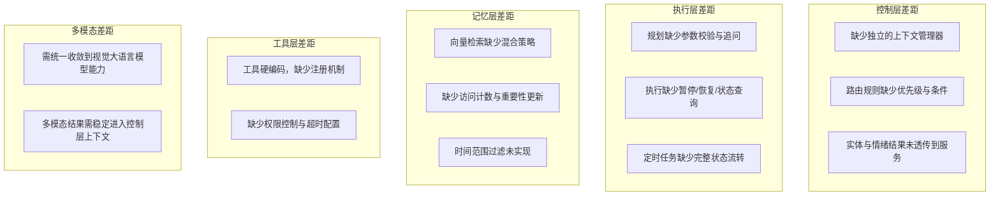
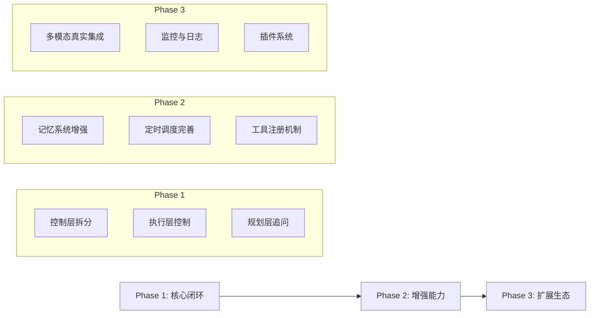

# 小悠项目完善计划

> 基于 [`docs/design.md`](../docs/design.md) 与当前实现的差距分析

## 1. 差距分析总览

### 1.1 已实现的核心能力

| 层级 | 模块 | 实现状态 | 说明 |
|------|------|----------|------|
| 表现层 | Discord 适配器 | ✅ 基础完成 | 消息收发、类型转换 |
| 表现层 | Telegram 适配器 | ✅ 基础完成 | 消息收发、类型转换 |
| 网关层 | 消息解析器 | ✅ 基础完成 | 实体提取、文本清洗 |
| 网关层 | 多模态提取器 | ✅ 已增强 | 基于视觉大语言模型接口抽象，支持外部视觉模型注入与 mock 降级 |
| 网关层 | 速率限制器 | ✅ 基础完成 | 基于内存的滑动窗口 |
| 控制层 | 意图识别器 | ⚠️ 简化实现 | 缺少实体/情绪透传 |
| 控制层 | 场景路由器 | ⚠️ 简化实现 | 缺少优先级规则 |
| 控制层 | 上下文管理器 | ❌ 未独立 | 逻辑内嵌在服务中 |
| 服务层 | 聊天服务 | ✅ 基础完成 | 含长期记忆检索 |
| 服务层 | 工具服务 | ⚠️ 占位实现 | 硬编码分支 |
| 服务层 | 任务服务 | ✅ 基础完成 | 规划+执行+归档 |
| 服务层 | 定时服务 | ⚠️ 简化实现 | 缺少完整状态管理 |
| 执行层 | 规划引擎 | ⚠️ 简化实现 | 缺少校验/追问 |
| 执行层 | 执行引擎 | ⚠️ 简化实现 | 缺少暂停/恢复/状态查询 |
| 执行层 | 调度引擎 | ⚠️ 简化实现 | 缺少完整任务模板 |
| 数据层 | 热记忆存储 | ✅ 基础完成 | Redis + TTL |
| 数据层 | 向量记忆存储 | ⚠️ 简化实现 | 缺少混合检索 |
| 数据层 | 记忆归档 | ✅ 基础完成 | 定期归档 + 任务归档 |

### 1.2 主要差距汇总



## 2. 分模块完善计划

### 2.1 控制层完善

**目标文件**: 
- [`src/controller/intent.ts`](../src/controller/intent.ts) - 新建
- [`src/controller/router.ts`](../src/controller/router.ts) - 新建
- [`src/controller/context.ts`](../src/controller/context.ts) - 新建
- [`src/controller/index.ts`](../src/controller/index.ts) - 重构

**设计目标对照**:

设计文档定义的接口：
```typescript
interface ControllerService {
  recognizeIntent(message: ParsedMessage): Intent;
  routeToScene(intent: Intent): SceneHandler;
  manageContext(sessionId: string): SessionContext;
}
```

**具体任务**:

1. **拆分意图识别器** (`intent.ts`)
   - 从 `index.ts` 提取 `IntentRecognizer` 类
   - 增强实体提取结果透传
   - 增加情绪分析字段（可调用 GLM 或规则匹配）

2. **增强场景路由器** (`router.ts`)
   - 实现基于优先级的路由规则
   - 支持条件匹配（如 `requiresPlanning: true`）
   - 支持路由规则的热更新

3. **新增上下文管理器** (`context.ts`)
   - 管理会话级上下文变量
   - 跟踪活动任务状态
   - 提供上下文快照能力

### 2.2 规划层完善

**目标文件**: 
- [`src/llm/nemotron.ts`](../src/llm/nemotron.ts) - 增强

**设计目标对照**:

设计文档定义的接口：
```typescript
interface PlannerService {
  createPlan(task: TaskDescription): Promise<ExecutionPlan>;
  updatePlan(planId: string, updates: Partial<ExecutionPlan>): Promise<ExecutionPlan>;
  validateParams(plan: ExecutionPlan): ValidationResult;
  generateClarification(missingParams: string[]): Promise<ClarificationQuestion>;
}
```

**具体任务**:

1. **新增计划校验** (`validateParams`)
   - 检查必需参数是否完整
   - 返回缺失参数列表

2. **新增追问生成** (`generateClarification`)
   - 根据缺失参数生成用户友好的追问
   - 支持多轮追问上下文

3. **新增计划更新** (`updatePlan`)
   - 支持动态修改执行计划
   - 保持计划版本一致性

### 2.3 执行层完善

**目标文件**: 
- [`src/executor/openclaw-agent.ts`](../src/executor/openclaw-agent.ts) - 增强

**设计目标对照**:

设计文档定义的接口：
```typescript
interface Executor {
  execute(step: ExecutionStep): Promise<StepResult>;
  executePlan(plan: ExecutionPlan): Promise<PlanResult>;
  pause(planId: string): Promise<void>;
  resume(planId: string): Promise<void>;
  cancel(planId: string): Promise<void>;
  getStatus(planId: string): Promise<ExecutionStatus>;
}
```

**具体任务**:

1. **新增执行控制**
   - `pause(planId)` - 暂停执行中的计划
   - `resume(planId)` - 恢复暂停的计划
   - `cancel(planId)` - 取消执行

2. **增强状态查询** (`getStatus`)
   - 返回当前步骤、已完成步骤、失败步骤
   - 支持等待用户状态

3. **完善重试策略**
   - 将 `RetryPolicy` 映射到实际重试逻辑
   - 支持指数退避

4. **分步骤结果回填**
   - 在 `PlanResult.stepResults` 中填充真实数据

### 2.4 定时调度完善

**目标文件**: 
- [`src/executor/openclaw-cron.ts`](../src/executor/openclaw-cron.ts) - 增强
- [`src/services/index.ts`](../src/services/index.ts) - 增强 `ScheduleService`

**具体任务**:

1. **完善任务模板**
   - 支持完整的 `ScheduleTask` 模型
   - 包含执行计划、通知配置、回调地址

2. **状态流转管理**
   - active → paused → active
   - active → expired
   - active → cancelled

3. **通知回调**
   - 任务完成时推送通知
   - 任务失败时告警

### 2.5 记忆系统完善

**目标文件**: 
- [`src/memory/hot.ts`](../src/memory/hot.ts) - 增强
- [`src/memory/vector.ts`](../src/memory/vector.ts) - 增强
- [`src/memory/flush.ts`](../src/memory/flush.ts) - 增强

**设计目标对照**:

设计文档定义的检索策略：
```typescript
interface RetrievalStrategy {
  method: 'similarity' | 'keyword' | 'hybrid';
  topK: number;
  threshold: number;
  timeRange?: TimeRange;
  filters?: Record<string, any>;
}
```

**具体任务**:

1. **热记忆增强** (`hot.ts`)
   - 完善活动任务跟踪
   - 支持上下文变量管理

2. **向量检索增强** (`vector.ts`)
   - 实现时间范围过滤
   - 实现混合检索（向量 + 关键词）
   - 更新访问计数和重要性

3. **归档增强** (`flush.ts`)
   - 用户偏好独立归档
   - 支持重要性衰减策略

### 2.6 工具扩展机制

**目标文件**: 
- [`src/tools/index.ts`](../src/tools/index.ts) - 重构

**设计目标对照**:

设计文档定义的工具接口：
```typescript
interface Tool {
  name: string;
  description: string;
  parameters: JSONSchema;
  execute(params: Record<string, any>): Promise<ToolResult>;
  requiredPermissions?: string[];
  timeout?: number;
}

function registerTool(tool: Tool): void;
function discoverTools(query: string): Tool[];
function invokeTool(name: string, params: Record<string, any>): Promise<ToolResult>;
```

**具体任务**:

1. **工具注册表**
   - 实现 `ToolRegistry` 类
   - 支持动态注册和发现

2. **权限控制**
   - 检查 `requiredPermissions`
   - 与用户权限系统对接

3. **超时配置**
   - 每个工具独立超时
   - 默认超时 + 自定义覆盖

### 2.7 多模态落地

**目标文件**: 
- [`src/gateway/multimodal.ts`](../src/gateway/multimodal.ts) - 增强
- [`src/controller/index.ts`](../src/controller/index.ts) - 集成

**具体任务**:

1. **视觉大语言模型集成**
   - 图片/截图：通过带视觉能力的大语言模型直接完成理解、识别与摘要
   - 文档/附件：优先将可预览文档交给视觉大语言模型统一解析，减少 OCR/版面解析链路分裂
   - 音频/视频：保留独立转写或分析接口，但整体多模态语义汇总统一进入视觉/多模态模型摘要流程

2. **上下文集成**
   - 多模态提取结果注入 `ParsedMessage`
   - 控制层可访问提取文本、标签与视觉摘要

### 2.8 类型与结构完善

**目标文件**: 
- [`src/types/index.ts`](../src/types/index.ts) - 增强

**具体任务**:

1. **补齐缺失接口**
   - `RetrievalStrategy` - 检索策略
   - `ControlAction` - 执行控制动作
   - `ErrorCategory` - 错误分类
   - `LogEntry` - 日志条目
   - `MonitoringMetrics` - 监控指标

2. **目录结构调整**
   - 按设计文档拆分 `controller/` 子模块
   - 按设计文档拆分 `services/` 子模块

### 2.9 测试覆盖

**目标文件**: 
- `tests/unit/controller.test.ts` - 新建
- `tests/unit/executor.test.ts` - 新建
- `tests/unit/memory.test.ts` - 新建

**具体任务**:

1. **控制层测试**
   - 意图识别准确性
   - 路由规则覆盖

2. **执行层测试**
   - 计划生成与校验
   - 执行状态流转

3. **记忆层测试**
   - 热记忆读写
   - 向量检索准确性

## 3. 实施优先级



### Phase 1: 核心闭环（建议优先）

| 任务 | 依赖 | 产出 |
|------|------|------|
| 控制层拆分 | 无 | 3 个新文件 |
| 执行层控制 | 控制层拆分 | 暂停/恢复/取消 |
| 规划层追问 | 执行层控制 | 参数校验 + 追问 |

### Phase 2: 增强能力

| 任务 | 依赖 | 产出 |
|------|------|------|
| 记忆系统增强 | 控制层拆分 | 混合检索 |
| 定时调度完善 | 执行层控制 | 完整状态管理 |
| 工具注册机制 | 控制层拆分 | 动态工具发现 |

### Phase 3: 扩展生态

| 任务 | 依赖 | 产出 |
|------|------|------|
| 多模态真实集成 | 控制层拆分 | 视觉大语言模型接入与统一摘要 |
| 监控与日志 | 全部 | 指标采集 |
| 插件系统 | 工具注册机制 | 扩展点机制 |

## 4. 风险与建议

### 4.1 技术风险

| 风险 | 影响 | 缓解措施 |
|------|------|----------|
| OpenClaw API 不支持暂停/恢复 | 执行层控制受限 | 先实现状态跟踪，后续协商 API |
| 向量检索性能 | 记忆系统响应慢 | 引入缓存层，预计算热门查询 |
| 多模态服务成本 | 预算超支 | 按需启用，设置配额 |

### 4.2 实施建议

1. **增量交付**: 每个 Phase 内的任务可独立交付，不阻塞其他开发
2. **向后兼容**: 新增接口保持对现有调用的兼容
3. **文档同步**: 每完成一个模块，同步更新 API 文档

## 5. 下一步行动

确认本计划后，建议切换到 **Code 模式**，按以下顺序开始实施：

1. 创建 `src/controller/intent.ts`、`router.ts`、`context.ts`
2. 重构 `src/controller/index.ts` 使用新模块
3. 增强 `src/executor/openclaw-agent.ts` 的控制能力
4. 增强 `src/llm/nemotron.ts` 的校验与追问能力
5. 补充对应单元测试
